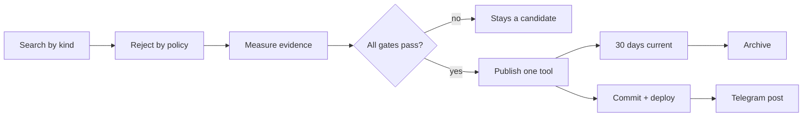

<div align="center">

# kgnx

### Known good. Try next.

Open-source tools that are still maintained — found automatically, published one at a time, and explained with public evidence.

[**Open the catalogue →**](https://lucasudar.github.io/kgnx/)

[](https://github.com/lucasudar/kgnx/actions/workflows/refresh-catalogue.yml)
[](https://github.com/lucasudar/kgnx/actions/workflows/deploy-pages.yml)


</div>

<!-- stats:start -->

| Published | Current | Archived | Chosen unattended | Screened last run | Waiting candidates |
| --- | --- | --- | --- | --- | --- |
| **59** | **59** | **0** | **1** | **151** | **31** |

24 app · 20 command line · 11 self-hosted · 4 browser extension. Evidence refreshed 20 Aug 2026, 18:39 UTC.

<!-- stats:end -->

---

## The idea

Finding a good tool is easy. Finding out whether it will still exist in six months is not.

Popularity charts answer the wrong question. A repository can have thousands of stars and no releases, no tests, one exhausted maintainer, and no commits since last winter. kgnx asks a different question on every card:

> **Can I depend on this?**

| | |
| --- | --- |
| 🔎 **Found by search** | Public GitHub API queries per kind of tool, not a trending chart |
| 🧪 **Gated by evidence** | Activity, releases, contributors, tests, CI, and licence must all pass |
| 🗓 **One at a time** | At most one new tool per day, rotating kinds so nothing dominates |
| 📦 **Archived, not deleted** | Current for 30 days, then searchable in the archive |
| 🕶 **Nobody in the loop** | No moderation queue, no approval step, no hidden database |

## What counts as a tool

Something you can run — not a library you build against, and not a reading list.

| Kind | Meaning | Where it runs |
| --- | --- | --- |
| **App** | A program with an interface | Desktop |
| **Command line** | A CLI or terminal UI | Terminal |
| **Self-hosted** | A service on hardware you control | Your server |
| **Browser extension** | An add-on for the browser | Firefox, Chrome, Safari |

## What a card tells you

The card leads with usefulness; the receipts sit one tap away.

**On the card** — kind · platforms · one-line purpose · traits · `Save` `Try next` `I use this`

**Under “Why trust it”** — last commit · maturity · contributors · releases · tests · CI · licence · language · stars · commits · upstream description · source link

Nothing decorative is invented. If a tool has no genuine icon, none is drawn. If metadata cannot prove an install command, the card says so instead of guessing.

## Publication rules

Every threshold below must pass, together, before anything is published unattended.

| Signal | Requirement |
| --- | --- |
| Last commit | within 21 days |
| Maturity verdict | `proven` |
| Commits | ≥ 100 |
| Contributors | ≥ 3 |
| Releases | ≥ 2 |
| Tests | detected |
| CI | configured |
| Licence | detected |
| Kind | proven by the project's own description |
| Policy | not a list, template, dependency, or high-risk category |

The bias is deliberate: useful tools are sometimes missed, but uncertain ones are not published. Automation earns trust by being strict and auditable — never by claiming that software is guaranteed safe.

## The daily run



Candidates, publications, evidence snapshots, and lifecycle transitions are all committed as JSON. Every automated decision has a public paper trail in the Git history.

## Your side of it

State lives in your browser. There is nothing to sign up for.

- `Save` — remember it
- `Try next` — a short queue you can actually finish
- `I use this` — the strongest signal for what you are shown next
- `Not for me` — hides it locally, never a public downvote

Discovery happens on a phone; installing happens at a desk. Cross-device sync is the next milestone, and a GitHub star will stay a separate, deliberate action rather than a side effect of saving.

## Run it yourself

Needs Python 3 and an authenticated GitHub CLI.

```bash
./run-everything.sh              # build the catalogue and serve it locally
./run-everything.sh --discover   # also search for and publish a new tool
```

Individual stages, in order:

```bash
python3 -m pipeline.discover     # search GitHub for candidates
python3 -m pipeline.autopublish  # publish at most one that clears every gate
python3 -m pipeline.lifecycle    # rotate 30-day windows into the archive
python3 -m pipeline.catalog      # refresh evidence for published tools
python3 -m pipeline.render       # build the static site
python3 -m pipeline.stats        # refresh the numbers in this README
```

## Repository map

| Path | Purpose |
| --- | --- |
| `data/catalog/` | Editorial and automatic catalogue entries |
| `data/candidates/` | Search candidates and the daily publication report |
| `data/editorial/` | Publication windows and archive state |
| `data/tools/feed.json` | Generated catalogue with evidence |
| `pipeline/discover.py` | Candidate search and policy filtering |
| `pipeline/evidence.py` | Explainable trust signals |
| `pipeline/autopublish.py` | Strict daily selection |
| `pipeline/lifecycle.py` | Current and archive rotation |
| `pipeline/catalog.py` | Evidence refresh |
| `pipeline/render.py` | Static PWA renderer |
| `pipeline/telegram.py` | Optional channel announcement |
| `web/` · `site/` | Source assets and generated output |
| `docs/` | Product, architecture, research, and roadmap |

## Telegram

Create a channel, add a bot as administrator, then set two repository secrets:

```text
TELEGRAM_BOT_TOKEN
TELEGRAM_CHAT_ID
```

The workflow posts only when a new tool was actually published. Without the secrets the step is skipped and publication continues normally.

## Documents

[Product](docs/PRODUCT.md) · [Architecture](docs/ARCHITECTURE.md) · [Research](docs/RESEARCH.md) · [GitHub API limits](docs/GITHUB_API.md) · [Roadmap](docs/ROADMAP.md) · [Hosting](docs/HOSTING.md)

<div align="center">

**Known good. Try next.**

</div>
